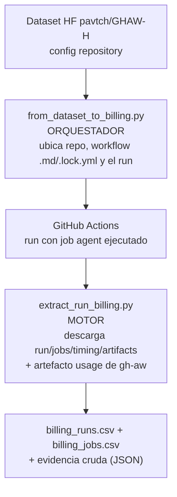

# Documentación de Billing — GitHub Agentic Workflows (gh-aw)


## 1. Propósito y alcance

**Objetivo de la investigación:** caracterizar **empíricamente** los costos asociados
a la ejecución de **GitHub Agentic Workflows (gh-aw) en repositorios públicos**,
considerando tanto los recursos de **GitHub Actions** como el **consumo de los
agentes de IA**, y analizar cómo varían según las tareas y características de las
ejecuciones.

Preguntas de investigación (RQ) de esta etapa:

| RQ | Pregunta |
| --- | --- |
| **RQ1** | ¿Cuál es el costo de ejecutar GHAW en repositorios públicos? |
| **RQ2** | ¿Cómo se distribuye el costo total entre GitHub Actions y el agente de IA? |
| **RQ3** | ¿Cómo varía el costo según el tipo de tarea? |

El instrumento registra además otros campos (duración, jobs, tokens, modelo,
`conclusion`) que permiten abordar preguntas adicionales en etapas posteriores.

**Este módulo de billing** es el **instrumento de medición** para responderlas. Para
cada run agéntico debe poder responder:

> **"¿Cuánto costó este run y de dónde salió cada número?"**

El costo total (según gh-aw) tiene **dos componentes independientes**:

1. **GitHub Actions minutes** (compute del runner).
2. **Inferencia de IA**, medida por gh-aw como **AI Credits (AIC)**.

Ambos aparecen por separado en la factura y tienen **fuentes de datos distintas**.

| RQ | Dónde se aborda en este documento |
| --- | --- |
| RQ1, RQ2 | columnas de costos Actions + AIC (sección 6) y conjunto de casos (sección 9) |
| RQ3 | tipo de tarea: workflow/propósito del `.md` del dataset GHAW-H (sección 4) |

---

## 2. Resumen ejecutivo

- **Billing = Actions + inferencia (AIC)**, dos costos que se cobran por separado.
- **`1 AIC = 0.01 USD`** es una **definición normativa** de gh-aw (AI Credits Spec sección 3.1), no un supuesto.
- **Cada número tiene fuente**: Actions REST API, timing API, artefacto `usage` de gh-aw, precios oficiales de GitHub y `models.json`.
- Hallazgo: en repos **públicos** GitHub **no cobra** Actions ⇒ hay que distinguir **costo facturado** (`actual`) de **precio de lista** (`notional`).
- El código anterior tenía **errores de procedencia** (flag inexistente `gh aw logs --run`, costo inventado en públicos, redondeo prematuro). Fueron corregidos.
- Hay **dos fuentes de AIC** que pueden diferir (`total_aic` canónico vs suma de registros); se guardan ambas para reconciliación.
- El flujo es **reproducible desde el dataset `pavtch/GHAW-H`**: repositorio → workflow `.md` → `.lock.yml` → run → billing.
- **Cobertura:** se puede estimar el costo en USD de **casi todos los runs** (incluso `failure`/`cancelled`, con jobs fallidos); lo que puede quedar `null` es, como máximo, la parte de **inferencia (AIC)**. Nunca se rellena con `0` ni con un valor inventado (ver la sección 10.4).

---

## 3. Billing: los dos costos

Fuente oficial: <https://github.github.com/gh-aw/reference/billing/>

> *"Running an agentic workflow incurs two types of cost: GitHub Actions minutes for compute, and AI inference charged by the model provider. Both appear independently on your bill."*

| Componente | Qué mide | Quién lo cobra | Fuente de datos |
| --- | --- | --- | --- |
| **GitHub Actions** | tiempo de runner (compute) | GitHub (dueño del repo) | Actions REST API (`/actions/runs/{id}`, `/jobs`, `/timing`, `/artifacts`) |
| **AI inference (AIC)** | tokens × precio por modelo | GitHub Copilot o proveedor (Anthropic/OpenAI/Google) | artefacto `usage` de gh-aw + `models.json` |

| Aspecto | Lado **Actions** | Lado **inferencia** |
| --- | --- | --- |
| Unidad | minutos × USD/min | AI Credits (`1 AIC = 0.01 USD`) |
| Dónde puede faltar | rara vez | si no corrió el `agent` o no hay artefacto `usage` |
| Repos públicos | gratis (facturado `0`) | se cobra igual |
| Dificultad de trazabilidad | baja | media (artefacto + catálogo de precios) |

---

## 4. Contexto: dataset GHAW-H y flujo completo

Origen de los datos: **<https://huggingface.co/datasets/pavtch/GHAW-H>**

Configs usadas:

| Config | Filas | Para qué |
| --- | --- | --- |
| `repository` | 262 | elegir el repositorio (`repository_id`, `repo_full_name`) |
| `source_markdown_file_snapshot` | 2820 | workflow agéntico (`.md`) del repo (`repository_id`, `path`, `content`, `frontmatter`) |
| `source_markdown_file_version` | 2820 | enlaza snapshot → versión (commit) |
| `lock_file_snapshot` | 2820 | YAML compilado (`*.lock.yml`) |

Relación: `repository.repository_id` → `source_markdown_file_snapshot.repository_id`
→ `source_markdown_file_version.source_markdown_file_snapshot_id` →
`lock_file_snapshot.source_markdown_file_version_id`.

**Cadena de procedencia y responsabilidad de cada script:**

Los scripts están **en capas**: uno *ubica* el run y el otro *extrae* el billing.



| Archivo | Rol | Qué hace | Qué **no** hace |
| --- | --- | --- | --- |
| `from_dataset_to_billing.py` | **Orquestador / punto de entrada** | Lee el dataset, deduce el workflow (`.md` → `.lock.yml`), lista sus runs y elige el más reciente con el job `agent` ejecutado (o el `--run` indicado). Luego delega. | No descarga ni calcula el billing: no habla con la API de Actions ni con `gh aw`. |
| `extract_run_billing.py` | **Motor / extractor** | Dado `--repo` + `run_id`(s): llama a la API de Actions, calcula Actions minutes y pide AIC/tokens a `gh aw logs --artifacts usage`. Escribe CSVs y evidencia cruda. | No busca runs: necesita que le pasen el `run_id`. |
| `extract_run_billing.ipynb` | **Versión didáctica** | Copia del motor, celda por celda. | No es un flujo aparte ni produce datos distintos: es el mismo cálculo. |

> En una frase: **`from_dataset_to_billing.py` encuentra el run y `extract_run_billing.py` lo factura**; el notebook solo lo muestra paso a paso.

---

## 5. Proceso de obtención de datos

### 5.1 ¿Hay web scraping? No

Todo sale de **APIs autenticadas**:
- **GitHub REST API** vía `gh api`.
- **Artefacto `usage`** vía `gh aw logs` (que internamente también usa la API de GitHub; nunca descarga HTML).
- El dataset se consume por la **API oficial** `https://datasets-server.huggingface.co/rows` (no scraping).

### 5.2 Comandos exactos

**Lado Actions** (`billing/extract_run_billing.py:364-382`):

```bash
gh api repos/{repo}/actions/runs/{run_id}                    # run.json
gh api repos/{repo}/actions/runs/{run_id}/jobs?per_page=100  # jobs.json
gh api repos/{repo}/actions/runs/{run_id}/timing             # timing.json
gh api repos/{repo}/actions/runs/{run_id}/artifacts          # artifacts.json
```

**Lado inferencia** (`billing/extract_run_billing.py:218-222`):

```bash
gh aw logs --stdin --repo {repo} --json --output {dir} --artifacts usage <<< "{run_id}"
```

**Flujo completo (dataset → billing):**

```bash
python billing/from_dataset_to_billing.py --repo vaadin/flow --run 36728232182
```

### 5.3 Condiciones para obtener TODOS los datos

**Datos de Actions** (casi siempre están) si:
1. `gh` está autenticado (`gh auth login`). Repo público: lectura basta. Privado: scope `repo`.
2. El run está **`completed`**. En `in_progress`/`queued` la `conclusion` es null, los jobs no están finalizados y `timing` puede venir vacío.
3. El label del runner mapea a un SKU conocido (`RUNNER_LABEL_TO_SKU`); si no, `runner_sku = null` y no se calcula tarifa.

**Datos de inferencia (AIC/tokens)** — requieren **las 3**:
4. El job **`agent` se ejecutó** (`conclusion != "skipped"`).
5. Existe el artefacto **`usage`** y **no expiró** (retención de artefactos de GitHub, ~90 días).
6. `run_summary.json` trae **`token_usage_summary` no nulo**.

> **Matiz clave:** los requisitos son `status = completed` (no necesariamente
> `conclusion = success`) y, para AIC, que el **agente** haya producido su artefacto
> `usage`. Un run fallido puede tener costo de Actions e incluso AIC; un run exitoso
> con artefacto expirado queda `null`. Detalle por escenario en la sección 5.5.

### 5.4 Paso a paso real (run 36728232182)

1. **Dataset → repo.** Lee `repository` y busca `vaadin/flow` (se pagina y cachea en `billing/dataset_cache/`).
2. **Dataset → workflow.** Lee `source_markdown_file_snapshot`, toma `doc-bot.md` y deriva `doc-bot.lock.yml`.
3. **Workflow → run.** Con `gh api .../actions/workflows` ubica el workflow y sus runs; con `--run` fija el run concreto; si no, elige el más reciente cuyo `agent` no esté `skipped`.
4. **Actions API.** Descarga run/jobs/timing/artifacts y calcula minutos (`ceil`) y costo nocional.
5. **Inferencia (gh-aw).** Descarga el artefacto `usage`; lee `run_summary.json → token_usage_summary` (`total_aic`, tokens, `by_model`) y contrasta con `usage/agent/token_usage.jsonl` (`ai_credits_this_response`).
6. **Conversión.** `aic_usd = aic × 0.01`; `estimated_total_cost_usd = notional + aic_usd`.
7. **Salida.** `billing_runs.csv`, `billing_jobs.csv`, `billing_row.json` y evidencia cruda.

**`audit/` es un comando aparte:** `gh aw audit <RUN_ID> --repo ... --json --output <dir>`. No viene "dentro" del run.

### 5.5 Escenarios: qué datos se obtienen según el resultado

El `conclusion` **global** del run no determina si obtenemos el costo. Lo que manda es:

- el **estado de cada job** para el lado Actions, y
- que el **job `agent`** haya producido el artefacto `usage` para el lado AIC.

Recordatorio de GitHub: el run pasa por `status` `queued → in_progress → completed`, y
`conclusion` (`success`, `failure`, `cancelled`, …) solo aparece al final. Un run es
`failure` si algún job falla **sin** `continue-on-error`; si el job fallido tiene
`continue-on-error: true`, ese job queda `failure` pero el run puede ser `success`.

Cómo lo trata el extractor (`analyze_jobs`, en `extract_run_billing.py`):

- Solo analiza jobs con `status = completed`.
- Jobs `skipped` cuentan como 0; `queued`/`in_progress` se omiten.
- Un job **fallido sí consume VM time**, por lo que **suma** al costo de Actions.
- La fila del run y los CSV **siempre se escriben**; lo que no se pudo obtener queda `null`.

| Escenario (run de 6 jobs) | `conclusion` del run | Jobs que corren | Costo Actions | AIC/tokens | Se guarda |
| --- | --- | --- | --- | --- | --- |
| Todos en `success` | `success` | 6 | 6 jobs | si el `agent` corrió | sí |
| Fallan los últimos 3 (sin `continue-on-error`) | `failure` | 3 (el resto `skipped`) | jobs corridos | si el `agent` corrió y dejó `usage` | sí |
| Fallan 2 con `continue-on-error: true` | `success` | 6 | 6 jobs | igual que arriba | sí |
| El `agent` falla temprano | `failure` | los que alcancen | jobs corridos | **`null`** (sin `usage`) | sí |
| Run cancelado | `cancelled` | los que alcanzaron | jobs corridos (tiempos parciales) | `null` salvo `usage` del `agent` | sí |
| Run `in_progress`/`queued` | `null` | — | parcial | `null` | sí (parcial) |
| Artefacto `usage` expirado (>~90 días) | cualquiera | — | normal | **`null`** | sí |

> Nota: con `fail-fast` (comportamiento por defecto) un job que falla **cancela** los
> jobs pendientes, que quedan `skipped`/`cancelled` y no (o casi no) suman costo.

**En una frase:** se puede facturar runs `failure`, `cancelled` o con jobs fallidos;
lo que se pierde, como máximo, es el lado **AIC** (y solo si el `agent` no dejó el
artefacto `usage`). Los campos faltantes se escriben como `null`, nunca se inventan
ni se asume `0`.

> Para el detalle **por job** (qué columnas se obtienen según `conclusion`), ver la
> sección 6.3.

---

## 6. Datos obtenidos: columnas y significados

Fuente de verdad: `billing/extract_run_billing.py`.

### 6.1 `billing_runs.csv` (nivel run)

| Columna | Significado | Fuente | Transformación |
| --- | --- | --- | --- |
| `repo` | `owner/repo` | dataset / CLI | — |
| `run_id` | ID del run | Actions API `run.id` | — |
| `run_attempt` | intento (re-runs comparten `run_id`) | Actions API | — |
| `workflow_id` | ID del workflow | Actions API | — |
| `workflow_name` | nombre | Actions API `name` | — |
| `event` | disparador | Actions API | — |
| `status` / `conclusion` | estado | Actions API | — |
| `created_at` / `run_started_at` / `updated_at` | timestamps | Actions API | — |
| `head_branch` / `head_sha` | rama y commit | Actions API | — |
| `html_url` | link al run | Actions API | — |
| `repo_private` | ¿repo privado? | Actions API | — |
| `run_duration_ms_github` | duración total **autoritativa** | **timing API** `run_duration_ms` | — |
| `actions_billable_by_os_json` | ms facturables por SO | **timing API** `billable.<OS>.total_ms` | — |
| `jobs_count` | nº de jobs | jobs API | — |
| `actions_vm_seconds` | suma de duraciones de jobs | calculado | `Σ (completed - started)` |
| `actions_ceil_minutes` | minutos por job, redondeados | calculado | `Σ ceil(seg/60)` |
| `actions_cost_usd_notional` | **precio de lista** | calculado | `Σ ceil_min × tarifa_SKU` |
| `actions_cost_usd_actual` | **facturado** | regla GitHub | privado → nocional; público → `0` |
| `runner_skus_json` | SKUs usados | mapeo label→SKU | — |
| `aic` | **AI Credits** del run | `run_summary.token_usage_summary.total_aic` | — |
| `aic_usd` | inferencia en USD | calculado | `aic × 0.01` |
| `input_tokens` / `output_tokens` | tokens entrada/salida | `token_usage_summary` | — |
| `cache_read_tokens` / `cache_write_tokens` | tokens de caché | `token_usage_summary` | — |
| `reasoning_tokens` | tokens de razonamiento | spec sección 3.7 | no reportado → `0` |
| `ai_request_count` | nº de requests al modelo | `token_usage_summary` | — |
| `ai_models` | modelos usados | `by_model` | — |
| `aic_from_records` | suma de `ai_credits_this_response` | `usage/agent/token_usage.jsonl` | reconciliación |
| `ai_provenance` | declaración de la fuente del AIC | extractor | — |
| `estimated_total_cost_usd` | total estimado | calculado | `notional + aic_usd` |

### 6.2 `billing_jobs.csv` (nivel job)

| Columna | Significado | Fuente |
| --- | --- | --- |
| `run_id` / `job_id` | identificadores | jobs API |
| `job_name` | `pre_activation`, `activation`, `agent`, `detection`, `safe_outputs`, `conclusion` | jobs API |
| `status` / `conclusion` | estado | jobs API |
| `started_at` / `completed_at` | timestamps | jobs API |
| `duration_seconds` | `completed - started` | calculado |
| `runner_name` | runner asignado | jobs API |
| `runner_labels_raw` | labels tal cual | jobs API |
| `runner_label_matched` | label que hizo match | mapeo |
| `runner_sku` | SKU de facturación | mapeo label→SKU |
| `rate_usd_per_min` | tarifa del SKU | doc GitHub |
| `ceil_minutes` | minutos del job | calculado |
| `actions_cost_usd_notional` | `ceil_minutes × rate` | calculado |

### 6.3 Disponibilidad a nivel de job según su `conclusion`

`billing_jobs.csv` tiene **una fila por job**. Qué campos se llenan depende del
`status`/`conclusion` del job (lógica en `analyze_jobs`, `extract_run_billing.py`).

Reglas del extractor:

- Solo entran jobs con `status = completed`; `queued`, `in_progress`, `waiting`,
  `pending`, etc. se **omiten** de la fila (solo cuentan en `jobs_count` del run).
- `duration_seconds = completed_at − started_at`, si ambos existen.
- `runner_sku`/`rate_usd_per_min` dependen **solo del label del runner**, no del resultado.
- `actions_cost_usd_notional = ceil_minutes × rate` (si hay SKU y tiempo).

| `conclusion` del job | ¿Fila en el CSV? | `started_at`/`completed_at` | `duration_seconds` | `runner_sku`/`rate` | `ceil_minutes` | `actions_cost` |
| --- | --- | --- | --- | --- | --- | --- |
| `success` | sí | presentes | calculada | según label | sí | sí |
| `failure` | sí | presentes (el job corrió) | calculada | según label | sí | **sí** |
| `timed_out` | sí | presentes (cortados al timeout) | calculada (truncada) | según label | sí | **sí** |
| `neutral` | sí | presentes | calculada | según label | sí | sí |
| `cancelled` | sí | presentes si alcanzó a iniciar | parcial / `null` | según label | sí si hay tiempo | parcial / `null` |
| `skipped` | sí | `null` | `0.0` | según label | `0` | `0.0` |
| `queued` / `in_progress` / `waiting` | **no** | — | — | — | — | — |

> **Dos matices:**
> 1. Un job **`failure` consume VM time igual que uno `success`**, así que aparece con
>    datos completos y **suma** al costo (no se descarta).
> 2. Si el **label del runner no mapea** a un SKU, quedan `runner_sku = null`,
>    `rate_usd_per_min = null` y `actions_cost_usd_notional = null` **aunque haya
>    duración**: se sabe que consumió tiempo, pero no se inventa tarifa.

AIC/tokens **no** se desglosan por job en el CSV: son a nivel run (sección 7) y
dependen de que el job `agent` haya dejado el artefacto `usage`.

---

## 7. AI Credits (AIC) e inferencia

### 7.1 Definición oficial

Fuente: **AI Credits Specification v1.4.0** — <https://github.github.com/gh-aw/specs/ai-credits-specification/>

- Sección 3.1: `1 AIC = 0.01 USD`.
- Sección 3.3 fórmula por invocación:

```
cost_usd = input_tokens×input_price + output_tokens×output_price
         + cache_read_tokens×cache_read_price + cache_write_tokens×cache_write_price
         + reasoning_tokens×reasoning_price
aic = cost_usd / 0.01
```

- Sección 3.4 fallbacks: `cache_read`→`input`, `cache_write`→`input`, `reasoning`→`output`.
- Sección 4 catálogo de precios `models.json` (USD por token).
- Sección 7 reporting: si hay `ai_credits_this_response` se prefiere; el último `ai_credits_total` válido es el total del run.

### 7.2 Fuente autoritativa de tokens/AIC

```
<output>/run-<RUN_ID>/run_summary.json  →  campo "token_usage_summary"
```

Incluye `total_input_tokens`, `total_output_tokens`, `total_cache_read_tokens`,
`total_cache_write_tokens`, `total_requests`, `total_aic` y `by_model`.

Detalle por request en `usage/<agent|detection|evals>/token_usage.jsonl` (guion bajo):
cada registro trae `input_tokens`, `output_tokens`, `cache_*_tokens`, `model`,
`ai_credits_this_response`, `ai_credits_total`.

> ⚠️ **Hallazgo de trazabilidad:** `run_summary.total_aic` (canónico) puede **no coincidir**
> con la suma de `ai_credits_this_response`. Ej.: `vaadin/flow` → `45.16788` vs `71.26752`
> (`github/gh-aw`, gpt-5.4, sí coinciden). Se guardan **ambos** (`aic` y `aic_from_records`).

### 7.3 Cómo obtener AIC/tokens por run

```bash
gh aw logs --stdin --repo <OWNER/REPO> --json --output <DIR> --artifacts usage <<< "<RUN_ID>"
# Alternativa (diagnóstico): 
gh aw audit <RUN_ID> --repo <OWNER/REPO> --json --output <DIR>
```

> AIC/tokens **solo existen si el job `agent` se ejecutó** y el artefacto `usage` trae `token_usage_summary`.

---

## 8. Precios de Actions y arquitectura

### 8.1 Tarifas oficiales

Fuente: <https://docs.github.com/en/billing/managing-billing-for-your-products/managing-billing-for-github-actions/about-billing-for-github-actions>

| SO / runner | SKU | USD/minuto |
| --- | --- | --- |
| Linux 1-core (x64) | `actions_linux_slim` | $0.002 |
| Linux 2-core (x64) | `actions_linux` | $0.006 |
| Linux 2-core (arm64) | `actions_linux_arm` | $0.005 |
| Windows 2-core (x64) | `actions_windows` | $0.010 |
| Windows 2-core (arm64) | `actions_windows_arm` | $0.010 |
| macOS 3/4-core | `actions_macos` | $0.062 |

**Nota crítica:** *"The use of standard GitHub-hosted runners is free: In public repositories"*. En repos públicos el Actions **facturado** es $0.

### 8.2 Mapeo label → SKU (explícito, sin heurística de texto)

| Label observado | Runner | SKU | Rate USD/min |
| --- | --- | --- | --- |
| `ubuntu-slim` | Linux 1-core | `actions_linux_slim` | 0.002 |
| `ubuntu-latest` / `ubuntu-24.04` / `ubuntu-22.04` | Linux 2-core x64 | `actions_linux` | 0.006 |
| `ubuntu-24.04-arm` / `ubuntu-22.04-arm` | Linux 2-core arm64 | `actions_linux_arm` | 0.005 |
| `windows-latest` / `windows-2022` / `windows-2025` | Windows 2-core x64 | `actions_windows` | 0.010 |
| `windows-11-arm` | Windows arm64 | `actions_windows_arm` | 0.010 |
| `macos-latest` / `macos-14` / `macos-15` / `macos-13` | macOS | `actions_macos` | 0.062 |
| `self-hosted` | no facturable por GitHub | — | — |

Si no hay match → `runner_sku = null` y **no** se inventa tarifa.

### 8.3 Del precio fijo del paper a las tarifas diferenciadas actuales

Los primeros avances (y el código previo `billing_data.ipynb`) usaban un **precio
base único** tomado de **Bouzenia y Pradel (ICSE 2024)**, sección **3.2 "Metrics
of Resource Usage"**, con precios de **marzo de 2023**:

```
VM cost = ⌈t × f⌉ × 0.008        # t = minutos, f = factor por SO
```

La tarifa base ($0.008/min) correspondía a una VM Linux estándar de 2 CPUs,
7 GB de RAM y 14 GB de disco. El estudio analiza runs de septiembre de 2020 a
febrero de 2023.

| SO | Factor `f` | Tarifa del paper (2023) |
| --- | --- | --- |
| Linux | 1 | $0.008 /min |
| Windows | 2 | $0.016 /min |
| macOS | 10 | $0.080 /min |

Ese modelo asumía un catálogo **homogéneo** (máquinas estándar x86 de 2 cores) y un
multiplicador lineal por sistema operativo. **Ya no es válido**: hoy las tarifas
de GitHub Actions se diferencian por **SO, arquitectura y tamaño**.

| Runner | Tarifa del paper (2023) | Tarifa actual | Fuente |
| --- | --- | --- | --- |
| Linux 2-core x64 | $0.008 /min | **$0.006 /min** | GitHub billing |
| Windows 2-core x64 | $0.016 /min (`f=2`) | **$0.010 /min** | GitHub billing |
| macOS | $0.080 /min (`f=10`) | **$0.062 /min** | GitHub billing |
| Linux ARM64 | — | **$0.005 /min** | GitHub billing |
| Windows ARM64 | — | **$0.010 /min** | GitHub billing |
| Linux 1-core (`ubuntu-slim`) | — | **$0.002 /min** | GitHub billing |

Además, GitHub incorporó **larger runners** (4, 8, 16… hasta 64/96 vCPU, y
opciones con GPU) cuyo costo por minuto escala según la capacidad solicitada
(aprox. desde ~$0.012/min para 4 vCPU hasta >$0.25/min en máquinas grandes). Es
decir, tampoco existe un único "tipo de VM".

**Consecuencia para el billing:** no se puede usar una constante `0.008` ni
factores `1/2/10`. Por eso `extract_run_billing.py` mapea **explícitamente**
`label del runner → SKU → tarifa` (sección 8.2), y deja `runner_sku = null`
cuando no hay match en lugar de asumir un precio.

---

## 9. Conjunto de casos y caso de referencia

El conjunto inicial comprende **cinco ejecuciones** de cuatro repositorios del dataset
`pavtch/GHAW-H`: `vaadin/flow` (Documentation Bot), `microsoft/vstest` (Issue Repro
Triage y Code Simplifier), `githubnext/agentics` (Daily Link Checker) y
`rancher/dashboard` (Daily Issue Grooming). El consolidado a nivel run está en
`billing/output/billing_runs_all.csv` y a nivel job en `billing/output/billing_jobs_all.csv`.

A continuación se detalla uno de ellos para ilustrar la estructura de la evidencia cruda.

### 9.1 Contexto del repositorio (`vaadin/flow`)

- `vaadin/flow`: framework Java de Vaadin, **público**, `Apache-2.0`, 745 stars.
- Registrado en `pavtch/GHAW-H` (`repository_id=8401317167309685863`).
- Workflow agéntico: **Documentation Bot** (`doc-bot.md` → `doc-bot.lock.yml`).
- Qué hace: en `pull_request_target`, cuando se asigna `vaadin-bot` a un PR mergeado, analiza cambios y crea un PR de documentación en `vaadin/docs`.

| Campo | Valor |
| --- | --- |
| `run_id` | `36728232182` |
| `run_attempt` | `1` |
| `workflow_id` / `workflow_name` | `236577655` / `Documentation Bot` |
| `event` | `pull_request_target` |
| `status` / `conclusion` | `completed` / `success` |
| `head_branch` / `head_sha` | `fix/quarkus-native-interface-implementations` / `56ab43d...` |
| `run_duration_ms_github` | `433000` (7 m 13 s) |
| `jobs_count` | `6` |
| `actions_vm_seconds` | `322.0` |
| `actions_ceil_minutes` | `9.0` |
| `actions_cost_usd_notional` | `0.038` |
| `actions_cost_usd_actual` | `0.0` (público) |
| `runner_skus_json` | `["actions_linux","actions_linux_slim"]` |
| `aic` | `45.16788` |
| `aic_usd` | `0.4516788` |
| tokens (in/out/cr/cw) | `11719` / `6873` / `886469` / `82262` |
| `reasoning_tokens` | `0` |
| `ai_request_count` | `14` |
| `ai_models` | `claude-sonnet-5` (anthropic) |
| `aic_from_records` | `71.26752` ⚠️ |
| `estimated_total_cost_usd` | `0.4896788` |

### 9.2 Jobs del run

| Job | Runner | Dur (s) | SKU | Tarifa | Min (ceil) | Nocional |
| --- | --- | --- | --- | --- | --- | --- |
| `pre_activation` | `ubuntu-slim` | 9 | `actions_linux_slim` | 0.002 | 1 | 0.002 |
| `activation` | `ubuntu-slim` | 29 | `actions_linux_slim` | 0.002 | 1 | 0.002 |
| `agent` | `ubuntu-latest` | 187 | `actions_linux` | 0.006 | 4 | 0.024 |
| `detection` | `ubuntu-latest` | 59 | `actions_linux` | 0.006 | 1 | 0.006 |
| `safe_outputs` | `ubuntu-slim` | 24 | `actions_linux_slim` | 0.002 | 1 | 0.002 |
| `conclusion` | `ubuntu-slim` | 14 | `actions_linux_slim` | 0.002 | 1 | 0.002 |
| **Total** | | **322** | | | **9** | **0.038** |

### 9.3 Hallazgo del motor (codex vs claude)

- El **dataset** (snapshot) declara `engine: codex`.
- El **workflow real del run** (`.lock.yml` descargado) dice `engine: claude`, `"agent_id":"claude"`; `aw_info.json` registra `engine_id: claude`, `model: agent`, Claude Code `2.1.227`, modelo `claude-sonnet-5`.
- **Conclusión:** no se usan "juntos"; es un **desfase entre el snapshot del dataset y el commit real del run**. → Punto a verificar/registrar.

---

## 10. Por qué unos runs tienen datos y otros no

### 10.1 Regla

```
AIC/tokens disponibles  ⟺  job `agent` ejecutado  AND  artefacto `usage`
                            con token_usage_summary  AND  se descargó
```

Si falla cualquiera → `aic = null` (**sin dato**, no "costo cero"). El costo de
Actions, en cambio, se obtiene igual aunque el run haya terminado en `failure`
(ver la matriz de escenarios en la sección 5.5).

### 10.2 Casos

| Run / repo | Conclusión | Job `agent` | Artefacto `usage` | `token_usage_summary` | AIC |
| --- | --- | --- | --- | --- | --- |
| **36728232182** `vaadin/flow` | success | ✅ ejecutado (187 s) | ✅ 3187 B | ✅ | **45.16788** |

Regla general: si el job `agent` no se ejecuta (p. ej. el run falla en
`activation`) o falta el artefacto `usage`/`token_usage_summary` (o expiró),
entonces `aic = null`. Los runs de prueba usados durante la exploración no se
conservan en esta rama.

### 10.3 ¿Y antes?

El notebook de exploración previo (ya retirado de la rama) usaba `gh aw logs --run <id>`, **flag inexistente** en v0.86.2 → fallaba en silencio y guardaba `aic = 0.0` para **todos**. Ahora: AIC real cuando hay `usage`; `null` cuando no.

### 10.4 Conclusión: qué podemos obtener realmente

Recordando el **objetivo de la investigación** (caracterizar los costos de gh-aw en
repositorios públicos; RQ1–RQ5) y, en particular, **RQ5** —*"¿qué proporción del costo
corresponde a ejecuciones que no finalizan exitosamente?"*—, la cobertura real es:

| Componente del costo | ¿Se puede estimar? | Cuándo falta |
| --- | --- | --- |
| **Actions (compute)** | **Casi siempre** | Run no `completed` (parcial), o label del runner sin SKU (`null`). |
| **Inferencia (AIC)** | Cuando el `agent` dejó `usage` | `agent` `skipped`, falló antes de dejar `usage`, o artefacto expirado (~90 días). |
| **Total** (`notional + aic_usd`) | Cuando están ambos | Si falta AIC, el total es un **piso** (solo Actions), no el total real. |

En consecuencia:

- **Se puede estimar el costo en USD de casi todos los runs**, incluidos los que
  terminan en `failure`, `cancelled` o con jobs fallidos: el compute se mide igual y
  los jobs fallidos **se facturan** (sección 6.3).
- Lo que queda en `null`, como máximo, es la parte de **inferencia (AIC)**: es el
  componente cuya disponibilidad depende del artefacto `usage`. Nunca se rellena con
  `0` ni con un valor inventado.
- El objetivo se cumple **con trazabilidad completa**: cada número es observable (API)
  o calculado (fórmula explícita), y la ausencia de un dato se declara como ausencia
  (`null`), no como cero. En repos públicos, el valor de Actions es **nocional**
  (precio de lista); lo facturado es `0`.

---

## 11. Conceptos y dudas resueltas (FAQ)

### 11.1 Actions nocional vs facturado

- `actions_cost_usd_notional` = **precio de lista** (`Σ ceil(min) × tarifa`). Útil para comparar.
- `actions_cost_usd_actual` = lo **realmente facturado**: `0` en repos públicos, nocional en privados.
- "SKU" = *Stock Keeping Unit*, el identificador de precio de GitHub (p. ej. `actions_linux`).

### 11.2 ¿Qué es AIC?

- **AI Credits**: unidad de costo de inferencia de gh-aw. `1 AIC = 0.01 USD` (definición oficial).
- `aic` = total de AIC; `aic_usd = aic × 0.01`.

### 11.3 ¿Por qué el total estimado es un poco más alto?

`estimated_total_cost_usd = actions_cost_usd_notional + aic_usd`.
En el caso de referencia (`36728232182`): `0.038 + 0.4516788 = 0.4896788`. Es más alto porque **suma los minutos de Actions (nocional)** al costo de inferencia; y es mayor que lo facturado en un público (donde Actions = 0). Los decimales largos son de punto flotante; no se redondea.

### 11.4 ¿El modelo es un campo obtenido o una inferencia?

**Obtenido** del artefacto `usage` (`token_usage_summary.by_model`, `agent_usage.json.primary_model`, y por request en `token_usage.jsonl`). No se infiere.

### 11.5 ¿Por qué hay tokens de entrada y de salida?

Porque los LLM cobran **distinto** por `input` (prompt, herramientas, historial, contexto) y `output` (lo generado), y además por `cache_read`/`cache_write`. Se necesitan todos para reproducir la fórmula de AIC.

### 11.6 ¿Hace falta descargar los `.md` y `.lock.yml`?

Para **billing, no**. Solo sirven para **identificar el workflow** y ubicar sus runs por `path`. El dataset ya los contiene; del `.md` se deriva el `.lock.yml`. (`gh aw logs` trae una copia en `base/` como subproducto.)

### 11.7 Motor `codex` vs modelo `claude`

Son conceptos distintos (motor = runtime; modelo = LLM). El dataset declara `codex`, pero el run real usó `claude`. Es un **desfase snapshot vs commit**, no un uso conjunto. Ver sección 9.3.

### 11.8 `dataset_cache/`

Caché **local** de las configs del dataset HF (`repository.json`, `source_markdown_file_snapshot.json`, ~72 MB). El endpoint `/rows` **no soporta `where`**, así que se pagina y cachea. Está **gitignored**.

### 11.9 `actions_billable_by_os_json`

Del **timing API**: `billable.<OS>.total_ms` (medida oficial de GitHub de minutos facturables por SO). Da `0` en públicos/sin acceso de facturación; por eso **no** se usa como fuente del costo.

### 11.10 Lado Actions vs lado inferencia

Ver tabla en sección 3. Actions = compute (GitHub); inferencia = tokens del modelo (proveedor). Fuentes, unidades y condiciones de disponibilidad distintas.

### 11.11 Razón y utilidad de `audit/`

`gh aw audit <run> --json --output <dir>` produce un **reporte de diagnóstico**: `audit.json` (overview, `metrics.action_minutes`, behavior fingerprint, key findings, recomendaciones, firewall) + logs + `run_summary.json`. Es un **comando explícito**, no parte del run, y no es la fuente primaria del billing.

---

## 12. Errores corregidos del código anterior

| Elemento anterior | Problema | Corrección |
| --- | --- | --- |
| `gh aw logs --run <id>` | flag **inexistente** → AIC siempre `0` | usar `--stdin` + `--artifacts usage` |
| `compute_cost_usd` | cobraba en repos públicos | distinguir `notional` vs `actual` |
| `round(..., 2/4)` | pérdida de precisión prematura | no redondear al guardar |
| `missing_ai_data` | ocultaba "fallo + sin artefacto" | `null` = sin dato, `0` = consumo cero |
| `paper_cost_usd` (`0.008`, factores 1/2/10) | fórmula de **Bouzenia y Pradel (ICSE 2024, sección 3.2)** con tarifas de 2023 ya **obsoletas** | mapeo explícito `label→SKU` con tarifas actuales (sección 8.3) |
| `infer_runner()` por texto | heurística no trazable | mapeo explícito label→SKU |

---

## 13. Precisión numérica

- Guardar **todos los decimales** de la fuente (p. ej. `1.0000000000000001e-07`).
- **No** aplicar `round()` antes de guardar; el formato solo al mostrar.
- Unidades explícitas en el nombre: `_usd`, `_minutes`, `_ms`, `_tokens`.

---


## 14. Referencias

- gh-aw Billing: <https://github.github.com/gh-aw/reference/billing/>
- AI Credits Specification: <https://github.github.com/gh-aw/specs/ai-credits-specification/>
- Catálogo de modelos: <https://raw.githubusercontent.com/github/gh-aw/main/pkg/cli/data/models.json>
- Copilot models & pricing: <https://docs.github.com/en/copilot/reference/copilot-billing/models-and-pricing>
- GitHub Actions billing: <https://docs.github.com/en/billing/managing-billing-for-your-products/managing-billing-for-github-actions/about-billing-for-github-actions>
- Dataset GHAW-H: Valenzuela-Toledo, P., Kehrer, T., & Panichella, S. (2026). *GHAW-H: A Dataset of GitHub Agentic Workflow Histories* (v0.1.2). Zenodo. <https://huggingface.co/datasets/pavtch/GHAW-H>
- Propuesta del proyecto (contexto): *Estudio Empírico de los Costos de Ejecución en GitHub Agentic Workflows* (G. Caniupán y C. Ñanco, Universidad de La Frontera).
- Actions timing endpoint: `GET /repos/{owner}/{repo}/actions/runs/{run_id}/timing`
- Bouzenia, I., & Pradel, M. (2024). *Resource Usage and Optimization Opportunities in Workflows of GitHub Actions*. En 2024 IEEE/ACM 46th International Conference on Software Engineering (ICSE '24), 1–12. DOI: <https://doi.org/10.1145/3597503.3623303> · PDF: <https://software-lab.org/publications/icse2024_workflows.pdf>. Sección 3.2 y comparación en la sección 8.3.
